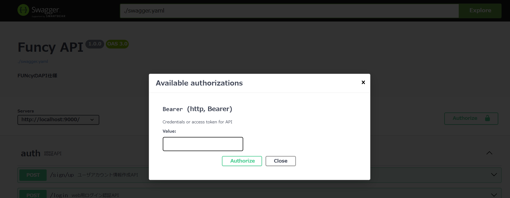
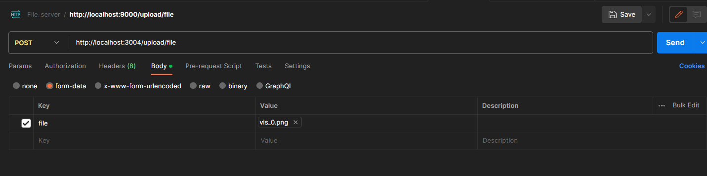

# Funcy-portfolio
# お約束

## プログラムを書く上で
基本的に下記のサイトに書いてることに従います。  
https://golang.org/doc/effective_go.html

## Github
#### Branch命名規則
- master
    - プロダクトとしてリリースするためのブランチ. 基本触らない
- develop(default)
    - 開発ブランチ． コードが安定し,リリース準備ができたら master へマージする. リリース前はこのブランチが最新バージョンとなる.
- feature
    - 機能の追加. develop から分岐し, develop にマージする.
    - feature-{任意で詳細}
- fix
    - 現在のプロダクトのバージョンに対する変更・修正用.
    - fix-{任意で詳細}
#### コミットメッセージ
- add:新機能
- fix:バグ修正
- wip:作業中（WIP：Work In Progress）
- clean:整理（削除も含む）

#### issue,Pull Requestのラベル(主に使って欲しいものを明記)
- bug バグの内容、解決したいことについて記述
- documentation ドキュメントの更新
- enhancement 新機能の開発
- help wanted 助けて欲しいこと(基本わからないことがあったらこれ書いて)
- question 質問、議論(わからないことではなく「これであっているのか不安だな」ということについて書いてください)
## レビュー体制
バックエンド班に依頼

## メールの確認方法について
現在、メールを用いた機能に関してはメール内容はログに出力されます。

例：ワンタイムパスワード

## 起動方法
developブランチを使用します。
これで検証用サーバを利用できます。
```
make up
# 別のターミナルを用意
make maigrate-demo
```
### APIドキュメント
以下のリンクからswagger UI にアクセス
[swagger UI](http://localhost:8002/)


### マイグレーション
golang-migrate環境がローカルにある人用
```
make migrate
```
### Tokenの取得方法
/sign/up でユーザ作成済みのアカウントでログインすることでTokenを受け取ることができます

mobile班：/mlogin
フロントエンド班：/login (cookieに含んで返すためbodyには含まれない)

#### swagger UIでのTokenの使い方
swagger UI 右上側にあるAuthorizeをクリックし、表示されるモーダルにTokenを入力することでTokenが必要なAPIを使用できるようになります。


### file server 起動方法
```
make file-server
```
### file-server 仕様
検証はPostmanを使うと楽です


##### エンドポイント
[http://localhost:3004/](http://localhost:3004/)

POST : http://localhost:3004/upload/file

リクエスト
```
# form-data
key:file, value:(画像ファイル)
```
レスポンス
```
{
    "urls": [
        "http://localhost:3004/fce8dec2-e50c-4a2f-ba5a-72150dfa1a20.png"
    ]
}
```

GET : http://localhost:3004/?????.jpg (file名)